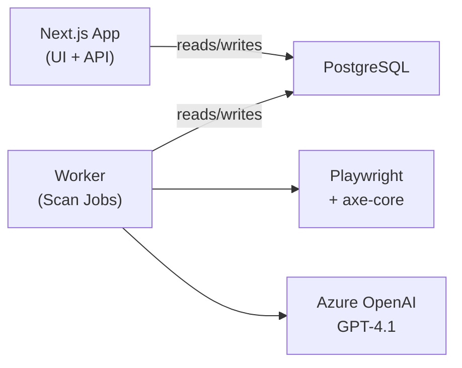

# ClearSight

ADA/WCAG compliance checker for websites. Enter a URL, get a detailed accessibility report with AI-powered analysis and actionable fix suggestions.

## What it does

- Scans any web page for WCAG 2.1 Level A & AA violations
- Uses **axe-core** as the scanning foundation + custom checks for link text and touch targets
- **AI-enriched reports** via Azure OpenAI GPT-4.1 — human-readable descriptions, fix suggestions, confidence scores
- Classifies issues as **Confirmed** (definitive failures) or **Potential** (needs review) with confidence scoring
- Dashboard with scan history, animated score gauge, filterable issue cards

## Architecture



<details>
<summary>ASCII version</summary>

```
┌──────────────┐     ┌────────────┐     ┌─────────────┐
│  Next.js App │────▶│ PostgreSQL │◀────│   Worker    │
│  (UI + API)  │     │            │     │ (Scan Jobs) │
└──────────────┘     └────────────┘     └──────┬──────┘
                                               │
                                    ┌──────────┴──────────┐
                                    │                     │
                              ┌─────▼──────┐      ┌──────▼───────┐
                              │ Playwright │      │ Azure OpenAI │
                              │ + axe-core │      │   GPT-4.1    │
                              └────────────┘      └──────────────┘
```

</details>

**Async job model:** User submits a URL → API creates a scan job in Postgres → background worker picks it up, runs a 5-stage pipeline (fetch → axe-core analysis → custom checks → LLM enrichment → store results) → frontend polls for progress and renders results.

## Tech Stack

| Layer      | Tech                                       |
|------------|--------------------------------------------|
| Framework  | Next.js 14+ (App Router), TypeScript        |
| UI         | Tailwind CSS, shadcn/ui, Lucide React       |
| Database   | PostgreSQL 16, Prisma ORM                   |
| Scanner    | Playwright (headless Chromium), axe-core     |
| AI         | Azure OpenAI GPT-4.1                        |
| Infra      | Docker Compose (app + worker + postgres)     |

## Quick Start

### With Docker (recommended)

```bash
# 1. Clone and configure
cp .env.example .env
# Edit .env with your Azure OpenAI API key

# 2. Start everything
docker compose up --build

# 3. Open http://localhost:3000
```

### Local Development

```bash
# 1. Install dependencies
npm install
npx playwright install chromium

# 2. Configure environment
cp .env.example .env
# Edit .env — set DATABASE_URL to your local Postgres, add Azure OpenAI key

# 3. Set up database
npx prisma db push

# 4. Start the app and worker in separate terminals
npm run dev          # Terminal 1: Next.js app on port 3000
npm run worker       # Terminal 2: Scan worker
```

## Scripts

| Command              | Description                          |
|----------------------|--------------------------------------|
| `npm run dev`        | Start Next.js dev server             |
| `npm run worker`     | Start scan worker process            |
| `npm run build`      | Production build                     |
| `npm run db:push`    | Push Prisma schema to database       |
| `npm run db:migrate` | Run Prisma migrations                |
| `npm run docker:up`  | Build and start all Docker services  |
| `npm run docker:down`| Stop all Docker services             |

## Project Structure

```
src/
├── app/                    # Next.js pages & API routes
│   ├── api/scans/          # REST API (create, list, get, cancel)
│   ├── scan/[id]/          # Scan results page
│   └── page.tsx            # Dashboard home
├── components/             # UI components
│   ├── layout/             # Shell, Sidebar
│   ├── scan/               # ScanForm, ScanProgress, ScanHistory
│   └── results/            # ScoreGauge, IssueCard, IssueTabs, etc.
├── modules/                # Core business logic (modular)
│   ├── ai/                 # AI provider interface + Azure OpenAI
│   ├── scanner/            # Playwright renderer + axe-core + custom engines
│   ├── pipeline/           # 5-stage scan pipeline
│   └── db/                 # Prisma repositories
├── config/                 # Centralized environment config
├── worker/                 # Background job worker
└── lib/                    # Utilities (rate limiting, URL validation, types)
```

## Environment Variables

| Variable                   | Description                                    |
|----------------------------|------------------------------------------------|
| `DATABASE_URL`             | PostgreSQL connection string                   |
| `AZURE_OPENAI_ENDPOINT`   | Azure OpenAI base URL (e.g. `https://your-endpoint.openai.azure.com`) |
| `AZURE_OPENAI_API_KEY`    | Azure OpenAI API key                           |
| `AZURE_OPENAI_API_VERSION`| API version (default: `2025-01-01-preview`)    |

## API Endpoints

| Method | Path                      | Description              |
|--------|---------------------------|--------------------------|
| POST   | `/api/scans`              | Create a new scan        |
| GET    | `/api/scans`              | List recent scans        |
| GET    | `/api/scans/:id`          | Get scan status/results  |
| POST   | `/api/scans/:id/cancel`   | Cancel a running scan    |
