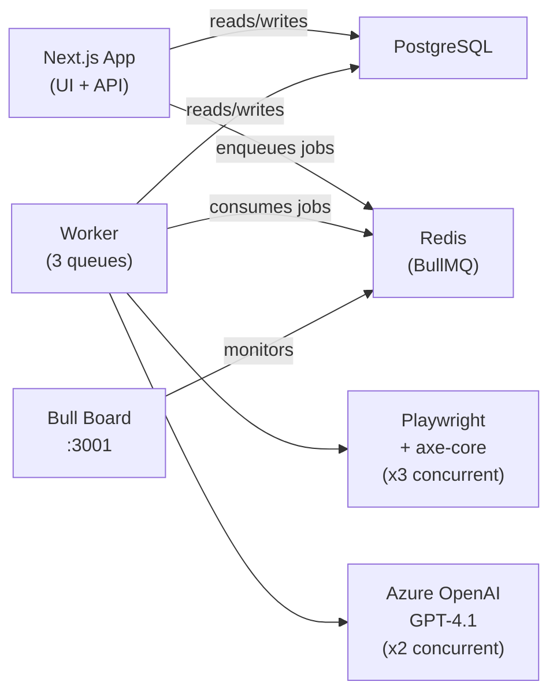
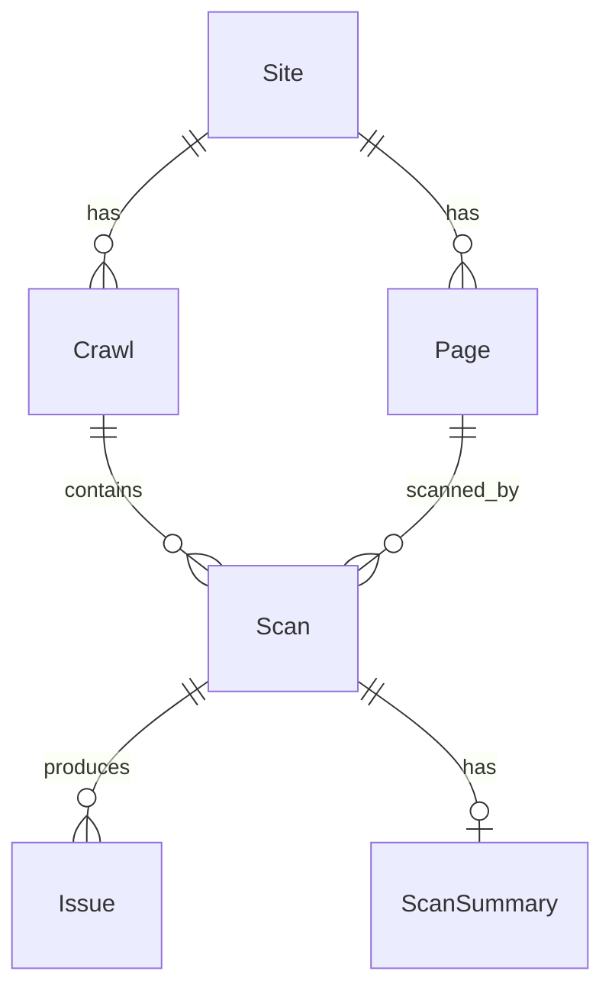

# ClearSight

ADA/WCAG compliance checker for websites. Crawl an entire site, scan every page for WCAG 2.1 Level A & AA violations, and get AI-powered reports with actionable fix suggestions — with issue tracking across crawls.

## What it does

- **Full-site crawl** — BFS discovery of same-origin pages via HTTP fetch + sitemap.xml, then concurrent scanning of every page
- **Single-page scan** — quick one-off scan of any URL (legacy mode, still fully supported)
- Uses **axe-core** as the scanning foundation + custom checks for link text and touch targets
- **AI-enriched reports** via Azure OpenAI GPT-4.1 — human-readable descriptions, fix suggestions, confidence scores
- **Issue tracking across crawls** — detects new, recurring, and fixed issues using content hashing (`issueHash`)
- Classifies issues as **Confirmed** (definitive failures) or **Potential** (needs review) with confidence scoring
- Dashboard with site overview, crawl history, per-page results, filterable issue cards
- **Solutions page** — marketing page describing use cases for agencies, developers, and enterprises
- **Chrome extension** — one-click single-page scan from any browser tab (Manifest V3, activeTab permission only)

## Architecture



<details>
<summary>ASCII version</summary>

```
┌──────────────┐     ┌────────────┐     ┌───────────────────┐
│  Next.js App │────▶│ PostgreSQL │◀────│      Worker       │
│  (UI + API)  │     │            │     │  (3 job queues)   │
└──────┬───────┘     └────────────┘     └────────┬──────────┘
       │                                         │
       │         ┌──────────┐                    │
       └────────▶│  Redis   │◀───────────────────┘
                 │ (BullMQ) │
                 └────┬─────┘
                      │
              ┌───────┴────────┐
              │   Bull Board   │
              │   (:3001)      │
              └────────────────┘
```

</details>

### Job Queue Pipeline

```
POST /api/sites/:id/crawl
  → crawl-discovery queue (BFS link discovery)
    → page-scan queue (Playwright + axe-core, x3 concurrent)
      → ai-enrichment queue (Azure OpenAI, x2 concurrent)
        → crawl finalization (aggregate scores, issue diff)
```

**Full-site crawl:** User registers a site → triggers a crawl → `crawl-discovery` job performs BFS link discovery (HTTP fetch + sitemap.xml) → spawns `page-scan` jobs for each discovered page (3 Playwright instances in parallel) → spawns `ai-enrichment` jobs for each scanned page (2 concurrent) → finalizes crawl with aggregated scores and issue diff (new/fixed/recurring).

**Single-page scan (legacy):** User submits a URL → API creates a scan job in Postgres → background worker picks it up → runs 5-stage pipeline (fetch → axe-core → custom checks → LLM enrichment → store) → frontend polls for results.

## Tech Stack

| Layer      | Tech                                          |
|------------|-----------------------------------------------|
| Framework  | Next.js 16 (App Router), TypeScript           |
| UI         | Tailwind CSS, shadcn/ui, Lucide React, Motion |
| Database   | PostgreSQL 16, Prisma ORM                     |
| Queues     | BullMQ + Redis                                |
| Scanner    | Playwright (headless Chromium), axe-core       |
| AI         | Azure OpenAI GPT-4.1                          |
| Docs       | Nextra                                        |
| Infra      | Docker Compose (app + worker + postgres + redis + bull-board) |

## Quick Start

### With Docker (recommended)

```bash
# 1. Clone and configure
cp .env.example .env
# Edit .env with your Azure OpenAI API keys

# 2. Start everything (app, worker, postgres, redis, bull-board)
docker compose up --build

# 3. Open http://localhost:3000
#    Bull Board admin UI: http://localhost:3001
```

### Local Development

```bash
# 1. Install dependencies
pnpm install
npx playwright install chromium

# 2. Configure environment
cp .env.example .env
# Edit .env — set DATABASE_URL, REDIS_URL, and Azure OpenAI keys

# 3. Set up database
pnpm db:push

# 4. Start services (each in a separate terminal)
pnpm dev          # Terminal 1: Next.js app on port 3000
pnpm worker       # Terminal 2: BullMQ worker (crawl + scan + AI queues)
pnpm bull-board   # Terminal 3: Bull Board admin UI on port 3001
pnpm docs:dev     # Terminal 4: Docs site on port 3002 (optional)
```

## Scripts

| Command                | Description                              |
|------------------------|------------------------------------------|
| `pnpm postinstall`     | Generate Prisma client (runs automatically after `pnpm install`) |
| `pnpm dev`             | Start Next.js dev server                 |
| `pnpm worker`          | Start BullMQ worker (all 3 queues)       |
| `pnpm build`           | Production build                         |
| `pnpm start`           | Start production server                  |
| `pnpm lint`            | Run ESLint                               |
| `pnpm db:push`         | Push Prisma schema to database           |
| `pnpm db:migrate`      | Run Prisma migrations                    |
| `pnpm db:generate`     | Generate Prisma client                   |
| `pnpm bull-board`      | Start Bull Board admin UI                |
| `pnpm docs:dev`        | Start Nextra docs site (dev)             |
| `pnpm docker:up`       | Build and start all Docker services      |
| `pnpm docker:down`     | Stop all Docker services                 |
| `pnpm docker:dev`      | Build and start dev Docker services      |
| `pnpm docker:dev:down` | Stop dev Docker services                 |

## Project Structure

```
src/
├── app/                        # Next.js pages & API routes
│   ├── api/
│   │   ├── sites/              # Sites + crawls + pages + issues API
│   │   └── scans/              # Legacy single-page scan API
│   ├── dashboard/              # Dashboard (site overview, crawl detail, pages, issues)
│   ├── scan/[id]/              # Redirect → /dashboard/scan/[id]
│   ├── solutions/              # Solutions marketing page
│   ├── how-it-works/           # Marketing page
│   ├── faq/                    # FAQ page
│   └── page.tsx                # Landing page
├── components/
│   ├── landing/                # Hero, Features, HowItWorks, etc.
│   ├── layout/                 # Shell, Sidebar
│   ├── scan/                   # ScanForm, ScanProgress, ScanHistory
│   ├── results/                # ScoreGauge, IssueCard, IssueTabs, etc.
│   └── inspector/              # InspectorPanel, ScreenshotViewer, HtmlViewer
├── modules/
│   ├── ai/                     # AI provider interface + Azure OpenAI
│   ├── scanner/                # Playwright renderer + axe-core + custom engines
│   ├── crawler/                # BFS discovery, URL normalizer, issue tracker
│   ├── queue/                  # BullMQ queue definitions and types
│   ├── pipeline/               # 5-stage scan pipeline (legacy)
│   ├── export/                 # PDF + Excel report generators
│   └── db/                     # Prisma repositories
├── worker/
│   ├── index.ts                # Worker entry point
│   └── processors/             # crawl, page-scan, ai-enrichment processors
├── config/                     # Centralized environment config
└── lib/                        # Utilities (rate limiting, URL validation, design tokens, types)

bull-board/                     # Standalone Bull Board admin UI
docs-site/                      # Nextra documentation site
extension/                      # Chrome extension — one-click single-page scan
```

## Data Model



**Core entities:** Site → Crawl → Page → Scan → Issue. Issues are tracked across crawls via `issueHash` — the system detects new, recurring, and fixed issues between runs. Each Crawl aggregates an `overallScore` plus `newIssues`/`fixedIssues` counts.

## Environment Variables

| Variable                     | Description                                    | Default                   |
|------------------------------|------------------------------------------------|---------------------------|
| `DATABASE_URL`               | PostgreSQL connection string                   | *(required)*              |
| `REDIS_URL`                  | Redis connection string                        | `redis://localhost:6379`  |
| `AZURE_OPENAI_ENDPOINT`     | Full Azure OpenAI chat completions URL (including deployment and api-version) | *(required)* |
| `AZURE_OPENAI_API_KEY`      | Azure OpenAI API key                           | *(required)*              |
| `AZURE_OPENAI_API_VERSION`  | API version                                    | `2025-01-01-preview`     |
| `MAX_CRAWL_PAGES`           | Max pages per crawl (unlimited if unset)       | *(none)*                  |
| `CRAWL_DELAY_MS`            | Delay between page fetches during discovery    | `200`                     |
| `WORKER_CONCURRENCY`        | Concurrent Playwright scan instances           | `3`                       |
| `AI_CONCURRENCY`            | Concurrent AI enrichment workers               | `2`                       |
| `BULL_BOARD_PORT`           | Bull Board admin UI port                       | `3001`                    |

## API Endpoints

### Sites & Crawls (full-site workflow)

| Method | Path                                      | Description                  |
|--------|-------------------------------------------|------------------------------|
| POST   | `/api/sites`                              | Create/register a site       |
| GET    | `/api/sites`                              | List all sites               |
| GET    | `/api/sites/:id`                          | Get site details             |
| POST   | `/api/sites/:id/crawl`                    | Trigger a full-site crawl    |
| GET    | `/api/sites/:id/crawls`                   | List crawls for a site       |
| GET    | `/api/sites/:id/crawls/:crawlId`          | Crawl detail                 |
| POST   | `/api/sites/:id/crawls/:crawlId/cancel`   | Cancel a crawl               |
| GET    | `/api/sites/:id/crawls/:crawlId/export`   | Export crawl report (PDF/Excel) |
| GET    | `/api/sites/:id/pages`                    | List pages for a site        |
| GET    | `/api/sites/:id/pages/:pageId`            | Page detail                  |
| GET    | `/api/sites/:id/issues`                   | List/filter issues           |
| GET    | `/api/sites/:id/issues/:issueId`          | Issue detail                 |

### Single-page scans (legacy)

| Method | Path                      | Description              |
|--------|---------------------------|--------------------------|
| POST   | `/api/scans`              | Create a new scan        |
| GET    | `/api/scans`              | List recent scans        |
| GET    | `/api/scans/:id`          | Get scan status/results  |
| POST   | `/api/scans/:id/cancel`   | Cancel a running scan    |
| GET    | `/api/scans/:id/export`   | Export report (PDF/Excel) |

## Services

| Service    | Port | Description                              |
|------------|------|------------------------------------------|
| Next.js    | 3000 | Web app + REST API                       |
| Bull Board | 3001 | BullMQ queue admin/monitoring UI         |
| Docs       | 3002 | Nextra documentation site                |
| Redis      | 6379 | BullMQ job queue backend                 |
| PostgreSQL | 5432 | Primary database                         |
